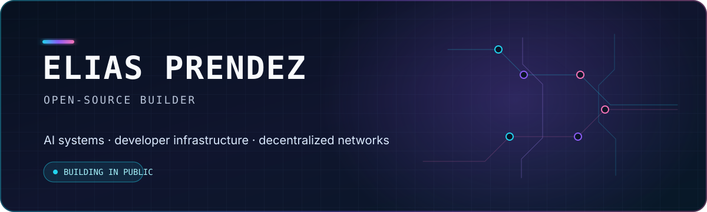

  

  
  
  

## Hello, open source 👋

I'm **Elias**, an engineer building open systems that make AI models measurable, deployable, and useful.

My public work sits at the intersection of **AI infrastructure**, **real-time voice intelligence**, and **decentralized networks**. I care about the parts that determine whether ambitious systems actually work: evaluation, verification, latency, observability, reproducibility, and contributor-friendly tooling.

> Build openly. Measure honestly. Document the path for the next contributor.

## Building now

Current public focus · September 2026

- 🎙️ **Prompt-conditioned voice intelligence** — evaluating content correctness, audio quality, and prompt adherence across competing models.
- 🔐 **Verifiable LLM inference** — proving miners serve real models through randomized hidden-state challenges.
- 🏠 **Generalization-first ML incentives** — evaluating property-price models against sales data unavailable when models were submitted.

## Featured projects

<table>
  <tr>
    <td width="50%" valign="top">
      <h3>🎙️ <a href="https://github.com/Miracle0524/vocence">Vocence</a></h3>
      
<strong>Open, incentivized voice intelligence on Bittensor.</strong>

      
Miners deploy PromptTTS models while validators score content correctness, naturalness, and adherence to requested voice traits. Cross-validator evidence is aggregated into deterministic, stake-weighted scoring.

      
<code>Python</code> <code>PyTorch</code> <code>Bittensor</code> <code>Docker</code>

      

        <a href="https://github.com/Miracle0524/vocence/blob/master/docs/validator-setup.md">Validator guide</a> ·
        <a href="https://github.com/Miracle0524/vocence/blob/master/miner_sample/MINER_GUIDE.md">Miner guide</a> ·
        <a href="https://github.com/Miracle0524/vocence/issues">Issues</a>
      

    </td>
    <td width="50%" valign="top">
      <h3>🏛️ <a href="https://github.com/Miracle0524/constantinople-subnet">Constantinople</a></h3>
      
<strong>Decentralized, verifiable LLM inference.</strong>

      
Miners serve Qwen models through vLLM. Validators challenge randomized layer and token positions, compare hidden states with reference computations, and score throughput, latency, and verification.

      
<code>Python</code> <code>vLLM</code> <code>Qwen</code> <code>Bittensor</code>

      

        <a href="https://github.com/Miracle0524/constantinople-subnet/blob/main/validator/README.md">Validator guide</a> ·
        <a href="https://github.com/Miracle0524/constantinople-subnet/blob/main/miners/README.md">Miner guide</a> ·
        <a href="https://github.com/Miracle0524/constantinople-subnet/issues">Issues</a>
      

    </td>
  </tr>
  <tr>
    <td width="50%" valign="top">
      <h3>🏠 <a href="https://github.com/Miracle0524/RESI-models">RESI Models</a></h3>
      
<strong>Real-estate prediction evaluated on genuinely unseen data.</strong>

      
Miners submit compact ONNX models before the evaluation cutoff. Validators score them against fresh residential sales, rewarding models that generalize instead of memorize.

      
<code>Python</code> <code>ONNX</code> <code>ML</code> <code>Bittensor</code>

      

        <a href="https://github.com/Miracle0524/RESI-models/blob/main/docs/MINER.md">Miner guide</a> ·
        <a href="https://github.com/Miracle0524/RESI-models/blob/main/docs/VALIDATOR.md">Validator guide</a> ·
        <a href="https://github.com/Miracle0524/RESI-models/issues">Issues</a>
      

    </td>
    <td width="50%" valign="top">
      <h3>⚡ <a href="https://github.com/Miracle0524/hermes-subnet">Hermes Subnet</a></h3>
      
<strong>Decentralized GraphQL query infrastructure.</strong>

      
Miners answer blockchain-data queries across SubQuery and The Graph projects. Validators generate schema-aware challenges and evaluate correctness, response time, and query efficiency.

      
<code>Python</code> <code>GraphQL</code> <code>Agents</code> <code>Bittensor</code>

      

        <a href="https://github.com/Miracle0524/hermes-subnet/tree/main/docs">Documentation</a> ·
        <a href="https://github.com/Miracle0524/hermes-subnet/blob/main/docs/local_test.md">Run locally</a> ·
        <a href="https://github.com/Miracle0524/hermes-subnet/issues">Issues</a>
      

    </td>
  </tr>
</table>

## Engineering focus

| Area | What I care about |
| --- | --- |
| 🤖 **Applied AI** | Evaluation harnesses, agents, retrieval, multimodal systems, and real-time inference |
| 🌐 **Decentralized AI** | Incentive design, validator consensus, miner infrastructure, and auditable scoring |
| ⚙️ **ML systems** | Serving performance, observability, deployment safety, and reproducible experiments |
| 🔎 **Search and data** | Hybrid retrieval, vector search, streaming pipelines, and reliable APIs |

## Toolbox

  

  <code>Transformers</code> · <code>ONNX</code> · <code>vLLM</code> · <code>Vector search</code> · <code>Kafka</code> · <code>gRPC</code> · <code>OpenTelemetry</code>

## Contributing

Useful contributions don't need to begin with a large pull request. I especially welcome:

- Reproducible bug reports and edge cases
- Evaluation ideas, benchmarks, and adversarial tests
- Miner and validator performance improvements
- Documentation fixes and clearer setup paths
- Small, focused pull requests with an explicit problem statement

Choose the repository closest to your idea and open an issue. Early questions are welcome—the goal is to make promising ideas testable together.

## Contribution trail

  <picture>
    <source media="(prefers-color-scheme: dark)" srcset="https://raw.githubusercontent.com/Miracle0524/miracle0524/output/github-contribution-grid-snake-dark.svg" />
    <source media="(prefers-color-scheme: light)" srcset="https://raw.githubusercontent.com/Miracle0524/miracle0524/output/github-contribution-grid-snake.svg" />
    
  </picture>

  <strong>Building open-source AI infrastructure, Bittensor tooling, or real-time voice systems?</strong> 
  Open an issue in the relevant repository and let's make it measurable.

